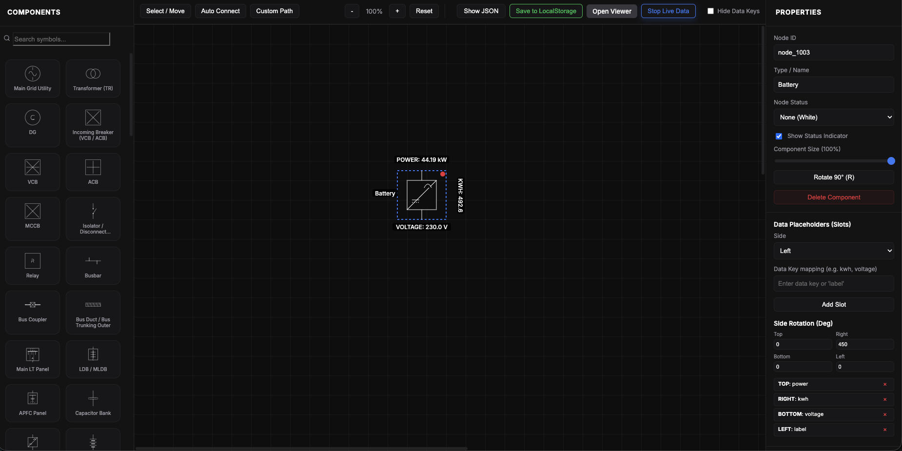

# ⚡ SLD Designer & Viewer

[](https://opensource.org/licenses/MIT)
[](https://www.npmjs.com/package/@trpz3/sld)
[](https://www.npmjs.com/package/@trpz3/sld)
[](https://github.com/Trpz3/sld/pulls)

A high-performance, professional-grade Single Line Diagram (SLD) logic designer and rendering engine. Built with vanilla JavaScript and SVG, designed for electrical engineering, industrial automation, and power systems monitoring.

[**Explore the Live Demo »**](https://trpz3.github.io/sld/)

---



## 🌟 Key Features

### 🎨 SLD Designer
- **Intuitive Drag-and-Drop**: Easily place symbols from a rich, searchable palette.
- **Smart Connections**: Auto-routing and custom pathing for complex electrical layouts.
- **Live Data Mapping**: Define "slots" on components to map real-time telemetry (voltage, current, status).
- **Responsive Workspace**: Infinite-feel canvas with zoom, pan, and collapsible sidebars for maximum focus.
- **Instant Export**: Download your configuration as a standardized JSON file.

### 👓 SLD Viewer (Production Module)
- **🚀 Zero Dependencies**: Lightweight ESM bundle with NO external dependencies (jQuery removed).
- **TypeScript Ready**: Full type definitions included for a professional developer experience.
- **Real-time Synchronization**: Built-in polling support for live status indicators and telemetry.
- **Rich Formatting**: Support for HTML-enhanced labels and status colors.
- **Extensible**: Fully customizable SVG symbol library.

## 🚀 Quick Start

### 1. Installation

Install the package via NPM:

```bash
npm i @trpz3/sld
```

### 2. Integration

Integrating the viewer into your dashboard is direct and type-safe:

```javascript
import '@trpz3/sld/style.css';
import { createSLDViewer } from '@trpz3/sld';

const viewer = createSLDViewer('sld-container', {
    config: mySavedConfigJson, // The JSON exported from the Designer
    liveData: { "node_1001": { status: "healthy", voltage: "230V" } },
    poll: {
        interval: 5000,
        fetch: async () => {
            const response = await fetch('/api/power-metrics');
            return response.json();
        }
    }
});
```

## 🛠 Development

### Local Setup
If you want to contribute or use the Designer locally:
```bash
git clone https://github.com/trpz3/sld.git
cd sld
npm install
npm run dev
```
Navigate to `http://localhost:5173` to start building your diagram.

### Production Build
Optimize the viewer library for production use:
```bash
npm run build
```
The output (JS, CSS, and Types) will be available in the `dist/` directory.

## 📂 Project Structure

```text
├── css/                # Global designer styles
├── dist/               # Build output (ESM, UMD, CSS, Types)
├── js/
│   ├── lib/            # Core SLD Viewer source code
│   └── symbols/        # Master SVG symbol definitions
├── index.html          # Main Designer interface
├── viewer.html         # Standalone viewer example
└── README.md
```

## 🤝 Contributing

We welcome contributions! Whether it's adding new SVG symbols, fixing bugs, or suggesting features:

1. Fork the Project
2. Create your Feature Branch (`git checkout -b feature/AmazingFeature`)
3. Commit your Changes (`git commit -m 'Add some AmazingFeature'`)
4. Push to the Branch (`git push origin feature/AmazingFeature`)
5. Open a Pull Request

## 📄 License

Distributed under the MIT License. See `LICENSE` for more information.

---

<p align="center">
  Built with ❤️ for the Electrical Engineering Community
</p>
